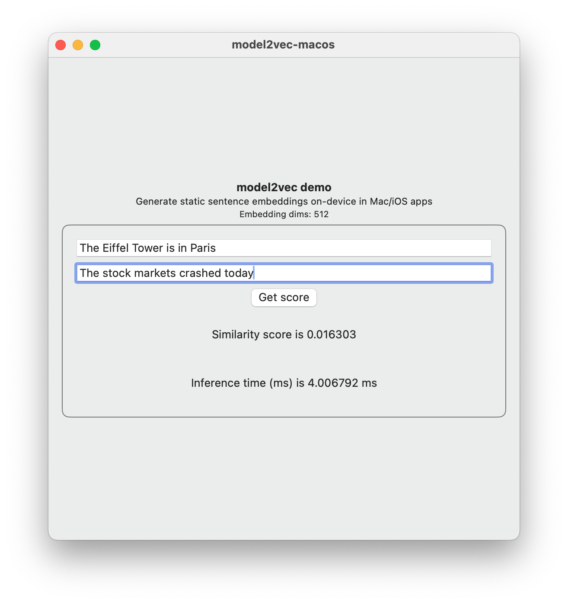

# model2vec.swift: Sentence Embeddings for iOS/macOS Apps

|   |   |
|---|---|
|  <center>Demo iOS App</center> | <center>Demo macOS App</center> |

## API Overview


```swift
import model2vecLib

let model2vec: Model2Vec = Model2Vec(
    modelPath: "<PATH>/embeddings.safetensors",
    tokenizerPath: "<PATH>/tokenizer.json"
)
let embeddingDims = model2vec.getEmbeddingDims()
let embeddings: [[Float]] = model2vec.getEmbeddings(
    texts: [
        "The cat sat on the mat.",
        "The stock market crashed today.",
        "We can have a meeting at 10 AM tomorrow.",
    ]
)
```

## Setup

### Using the Swift Package

#### Adding the Swift Package in Xcode

1. Right-click on the project in the Project Navigator, select **Add Package Dependencies**.

2. In the text-field (top-right corner), enter the URL of this GitHub repo. In the right pane, after the package detailed are visible, select **Dependency Rule - Exact Version - 0.1.0** and click **Add Package**.


#### Adding the Swift Package with `Package.swift`

Add the following `.package` declaration in your `Package.swift`,

```swift
.package(url: "https://github.com/shubham0204/model2vec.swift", from: "0.1.0")
```

### Compiling the Rust source code

See [`model2vec-rs/Makefile`](./model2vec-rs/Makefile) to see how the Rust code is compiled and a XCFramework is built. Install the following Apple-based targets,

```bash
# arm64 based Apple targets
rustup target add aarch64-apple-darwin
rustup target add aarch64-apple-ios
rustup target add aarch64-apple-ios-sim
# x64 based Apple targets
rustup target add x86_64-apple-darwin
rustup target add x86_64-apple-ios
```

and then execute in the `model2vec-rs` directory,

```bash
make clean
make build-xcframework
```

### Running the Demo macOS/iOS apps

1. Clone the repository locally,

```bash
git clone --depth=1 https://github.com/shubham0204/model2vec.swift
```

2. In the resulting directory, open the `model2vec-demo/model2vec-demo.xcodeproj` or using the terminal,

```bash
open model2vec-demo/model2vec-demo.xcodeprj
```

3. Download the model2vec model files from HuggingFace,

```bash
cd model2vec-demo
wget https://huggingface.co/minishlab/potion-base-32M/resolve/main/model.safetensors
wget https://huggingface.co/minishlab/potion-base-32M/resolve/main/tokenizer.json
```

4. Build the project, and launch the `model2vec-macos` or `model2vec-ios` schemes to run the apps (the model files are bundled with the apps).

## Project Structure

The current directory holds the `Sources` and `Tests` for the `model2vec` Swift package. Check the [`Package.swift`](./Package.swift) for a detailed overview of the package. Other than the Swift package, the current directory two additional project components:


- `model2vec-demo`: A Xcode project containing two app targets, one for macOS and another for iOS demonstrating the use of model2vec to find the similarity between two given sentences. The UI is shared between both targets and is built with SwiftUI.


- `model2vec-rs`: A Rust project that uses `safetensors` and `tokenizers` crates to read the embeddings binary file, tokenize the input sentence and provide a fixed-size embedding for the input. The Rust code in the project is compiled to a static archive `.a` which is consumed by the Swift package.

## Working

1. The [official model2vec Python package](https://github.com/MinishLab/model2vec) reads a list of embeddings from `embeddings.safetensors` file and indexes an embedding from this list using the IDs of the tokenized input. The embeddings for all tokens of the input text are then pooled (aggregated along `dim=1`) to produce a single embedding.

2. The HuggingFace `transformers` package uses the [`safetensors`](https://github.com/huggingface/safetensors) and [`tokenizers`](https://github.com/huggingface/safetensors) Python packages to read the embedding files and tokenize the input. Although they are Python packages, there core functionality is written in Rust. We utilize the Rust code of these libraries directly in `model2vec-rs` and build an API to interact with the model.

3. To bring the functionality of `model2vec-rs` in Swift, we first build a C API (see `model2vec-rs/include/model2vec.h`) which can be used alongside the static library produced by `cargo build`. The `module.modulemap` file in `model2vec-rs/include` tells Swift to include the `model2vec.h` header and provide a Swift-compatible wrapper, essentially converting the [C function prototypes to Swift functions](https://developer.apple.com/documentation/swift/c-interoperability). The static libraries for `darwin`, `ios` and `ios-sim` are packed together in a [XCFramework](https://developer.apple.com/documentation/xcode/creating-a-multi-platform-binary-framework-bundle) which is then consumed by the Swift package in the project directory.

4. Until now, the model2vec APIs are still C-styled APIs. The Swift package wraps these functions in a class, `Model2Vec`, performing OOP-style initialization and method calling. The Swift package is what the end-user will include in their iOS/macOS application to use `Model2Vec`.

## About model2vec

> This section is taken from my blog [Model2Vec - Faster Sentence Transformers In Rust](https://shubham0204.github.io/blogpost/programming/model2vec-rs)

[Model2Vec](https://github.com/MinishLab/model2vec) is a technique from [MinishLab](https://github.com/MinishLab) wherein static-embeddings are generated from a sentence-transformer model, thus reducing the process of encoding a sentence to a tokenize + lookup + pool operation instead of performing a forward-pass on the sentence-transformer model.
### What is Model2Vec?

- The vocabulary of a sentence-transformer model is about 32K tokens. We can store the embeddings for each of these tokens in a lookup table. 
- To encode a sentence, we tokenize it, fetch the token embeddings from the lookup table and pool them to get a sentence embedding. 
- As you might have noticed, these **embeddings are not contextual** i.e. the embedding of a token does not depend on the tokens preceding it in the input sequence. 
- These embeddings are also compressed with PCA to reduce their dimensions.
- The authors claim that the use of PCA increases performance as it normalizes the resulting space.

### Motivation
#### On-Device RAG

- A fast sentence-embedding model can be useful in RAG applications where semantic similarity between two pieces of text has to be computed. 
- The size of the lookup table for 32K tokens with each token having an embedding of length 256 sums to $32000 \times 256 \times sizeof(float32) = 32768000 \ \text{bytes} = 32.7 \ \text{MB}$
- This is ideal for on-device applications, for e.g. on mobile devices, where there are space constraints.

#### Conversion to a more portable format

- The codebase for Model2Vec is in Python, which is not a good choice to run it in a native Android or iOS application.
- The Python package `model2vec` essentially loads the embeddings from a `safetensors` file and the tokenizer from `tokenizer.json` (HuggingFace tokenizers) and computes the sentence embeddings.
- The good news, both, the HuggingFace [`tokenizers`](https://github.com/huggingface/tokenizers) and HuggingFace [`safetensors`](https://github.com/huggingface/safetensors) are written in Rust. The authors of Model2Vec provide a pre-distilled version of  [baai/bge-base-en-v1.5](https://huggingface.co/baai/bge-base-en-v1.5) sentence transformer model.
- We can use the Rust packages of `tokenizers` and `safetensors` to write a library which produces sentence embeddings and then expose C-like interface for interaction with other languages (like Kotlin/Java for Android).


## License

```
Copyright 2025 Shubham Panchal

Licensed under the Apache License, Version 2.0 (the "License");
you may not use this file except in compliance with the License.
You may obtain a copy of the License at

    http://www.apache.org/licenses/LICENSE-2.0

Unless required by applicable law or agreed to in writing, software
distributed under the License is distributed on an "AS IS" BASIS,
WITHOUT WARRANTIES OR CONDITIONS OF ANY KIND, either express or implied.
See the License for the specific language governing permissions and
limitations under the License.
```